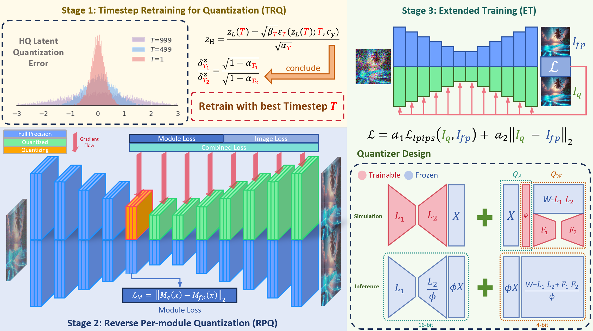
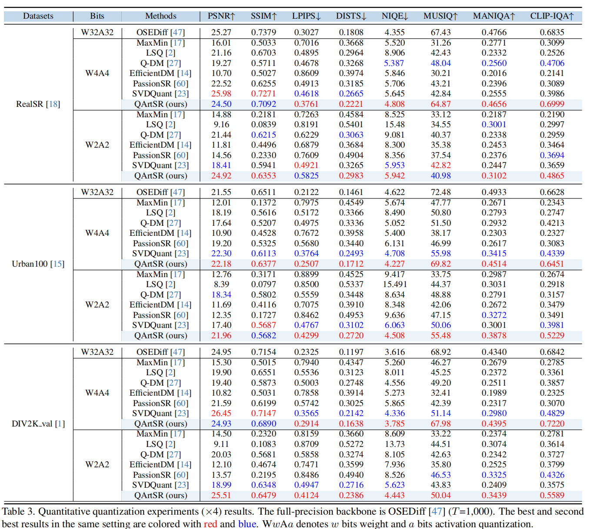
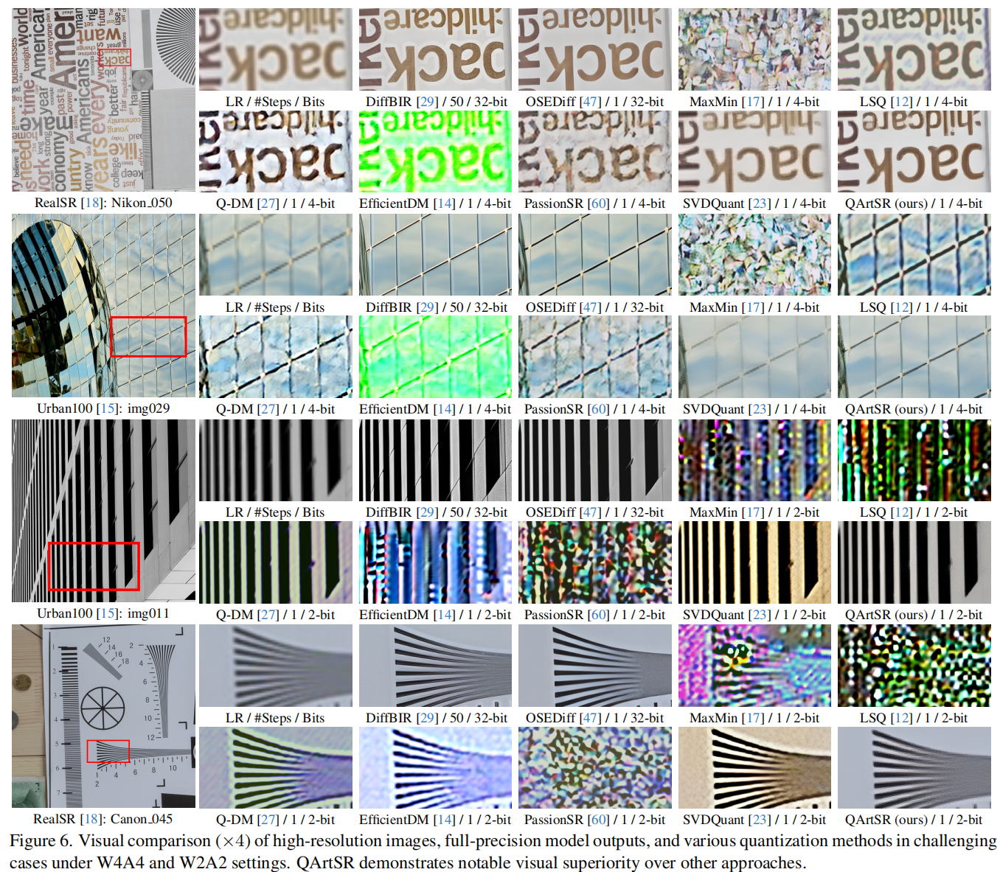

<div align="center">
<p align="center" style="margin-bottom: 5px;"> 
     
</p>
</div>

<h1 style="margin-top: 10px;">QArtSR: Quantization via Reverse-Module and Timestep-Retraining in One-Step Diffusion based Image Super-Resolution</h1>


[LiBo Zhu](https://github.com/LiBoZhu030073), [Haotong Qin](https://htqin.github.io/), [Kaicheng Yang](https://racoonykc.github.io/), [Wenbo Li](https://fenglinglwb.github.io/), [Yong Guo](https://www.guoyongcs.com/), [Yulun Zhang](http://yulunzhang.com/), [Susanto Rahardj](https://www.singaporetech.edu.sg/directory/faculty/susanto-rahardja) and [Xiaokang Yang](https://scholar.google.com/citations?user=yDEavdMAAAAJ), "QArtSR: Quantization via Reverse-Module and Timestep-Retraining in One-Step Diffusion based Image Super-Resolution", arXiv, 2025

[[arXiv](https://arxiv.org/abs/2411.17106)] [supplementary material] [visual results]

#### 🔥🔥🔥 News

- **2025-3-8:** This repo is released.

> **Abstract:** One-step diffusion-based image super-resolution (OSDSR) models are showing increasingly superior performance nowadays. However, although their denoising steps are reduced to one and they can be quantized to 8-bit to reduce the costs further, there is still significant potential for OSDSR to quantize to lower bits. To explore more possibilities of quantized OSDSR, we propose an efficient method, Quantization viA reverse-module and timestep-retraining for OSDSR, named QArtSR. Firstly, we investigate the influence of timestep value on the performance of quantized models. Then, we propose Timestep Retraining Quantization (TRQ) and Reversed Per-module Quantization (RPQ) strategies to calibrate the quantized model. Meanwhile, we adopt the module and image losses to update all quantized modules. We only update the parameters in quantization finetuning components, excluding the original weights. To ensure that all modules are fully finetuned, we add extended end-to-end training after per-module stage. Our 4-bit and 2-bit quantization experimental results indicate that QArtSR obtains superior effects against the recent leading comparison methods. The performance of 4-bit QArtSR is close to the full-precision one.



<!-- ---

[](https://imgsli.com/MjIyMjk5) [](https://imgsli.com/MjIyMzAy) [](https://imgsli.com/MjIyMzEw) [](https://imgsli.com/MjIyMzA4)

[](https://imgsli.com/MjIyMzA0) [](https://imgsli.com/MjIyMzAw) [](https://imgsli.com/MjIyMjk3) -->

---

|                      HR                      |                   LR  ($\times$ 4)                 |             DiffBIR(32-bit)             | OSEDiff(32-bit)  |             PassionSR(8-bit)             |    QArtSR(4-bit)             |
| :------------------------------------------: | :------------------------------------------: | :---------------------------------------------: | :---------------------------------------------: | :---------------------------------------------: | :---------------------------------------------: |
|  |  |  |  |  |   |
|  |  |  |  |  |   |
## ⚒️ TODO

* [ ] Release code and pretrained models

## 🔗 Contents

1. Datasets
1. Calibration
1. [Results](#results)
1. [Citation](#citation)

## <a name="results"></a>🔎 Results

QArtSR significantly out-performs previous methods at the setting of W4A4, W3A3, and W2A2.


Evaluation on Synthetic Datasets


<details>
<summary>quantitative comparisons in Table 3 of the main paper (click to expand)</summary>
<p align="center">
  
</p>

</details>

<details>
<summary>visual comparison in Figure 6 of the main paper (click to expand)</summary>
<p align="center">
  
</p>
</details>

## <a name="citation"></a>📎 Citation

If you find the code helpful in your research or work, please cite the following paper(s).

```
@article{zhu2024passionsr,
  title={PassionSR: Post-Training Quantization  with Adaptive Scale in One-Step Diffusion based Image Super-Resolution},
  author={Libo Zhu, Jianze Li, Haotong Qin, Wenbo Li, Yulun Zhang, Yong Guo and Xiaokang Yang},
  journal={arXiv preprint arXiv:2411.17106},
  year={2024}
}
```
